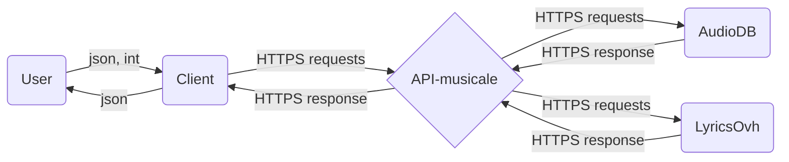

# API-musicale

Author : MACAUX Lucas

## What is an API-musicale ?

You live in Rennes and you want to sing in Musikam, the biggest french karaoke-club, but you don't know what songs to perform ?

Don't worry, the API-musicale is here for **you** !

You just need to indicate a list of singers/musicians you like, and how much do you like them, and **HOP!** the API-musicale makes your evening a ✨ _magical moment_ ✨ !

## Description of the project

The project consists of the realization of a musical API, which is based on the use of 2 external APIs: [AudioDB](https://www.theaudiodb.com/api_guide.php) and [Lyricsovh](https://lyricsovh.docs.apiary.io/).

This musical API is able to:
* randomly get the song of a given artist as input
* create a playlist of _x_ songs from a file following the pattern of the _rudy.json_ file, with _x_ a number chose by the user.

## Quick Start

### Installation
```
git clone https://github.com/DonMako/API-musicale
cd API-musicale
pip install -r requirements.txt
```

### Running the application
```
python main.py
```

### The 'Rudy' scenario

_Rudy wants to have a karaoke night with friends. The evening starts soon and the playlist is not ready! In addition, Rudy has very specific musical tastes, he only likes certain artists. Rudy therefore wishes to automatically generate a playlist of music with lyrics only composed of music from his favorite artists.
Rudy having done a national school of statistics and information analysis, he prepared a JSON file containing the names of his favorite artists.
He now wants to generate a playlist of 20 songs from this file._

#### To launch this scenario:

```
python main.py
3
```

## Simple macro architecture diagram of the application



## To run some tests

For the moment, only one test is coded into the project.

To run this test:
```
cd tests
python testAPI.py
```
