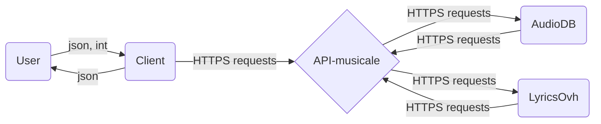

# Schéma d'architecture


```mermaid
flowchart LR
    A(User) -->|json, int| B(Client)
    B -->|json| A
    B -->|HTTPS requests| C{API-musicale}
    C -->|HTTPS requests| D(AudioDB)
    C -->|HTTPS requests| E(LyricsOvh)
    D -->|HTTPS requests| C
    E -->|HTTPS requests| C
```

# Installation

```
git clone https://github.com/DonMako/API-musicale
cd API-musicale
pip install -r requirements.txt
python main.py
```