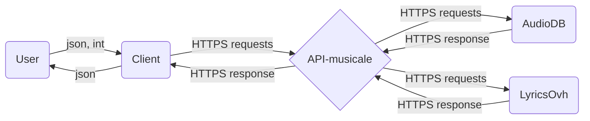

# API-musicale

# What is an API-musicale ?

You live in Rennes and you want to sing in Musikam, the biggest french karaoke-club, but you don't know what songs to perform ?

Don't worry, the API-musicale is here for **you** !

You just need to indicate a list of singers/musicians you like, and how much do you like them, and **HOP!** the API-musicale makes your evening a ✨ _magical moment_ ✨ !

## Installation

```
git clone https://github.com/DonMako/API-musicale
cd API-musicale
pip install -r requirements.txt
python getPlaylist.py
```

## Simple macro architecture diagram of the application


